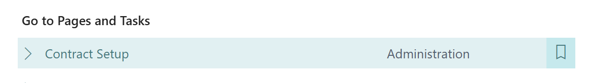
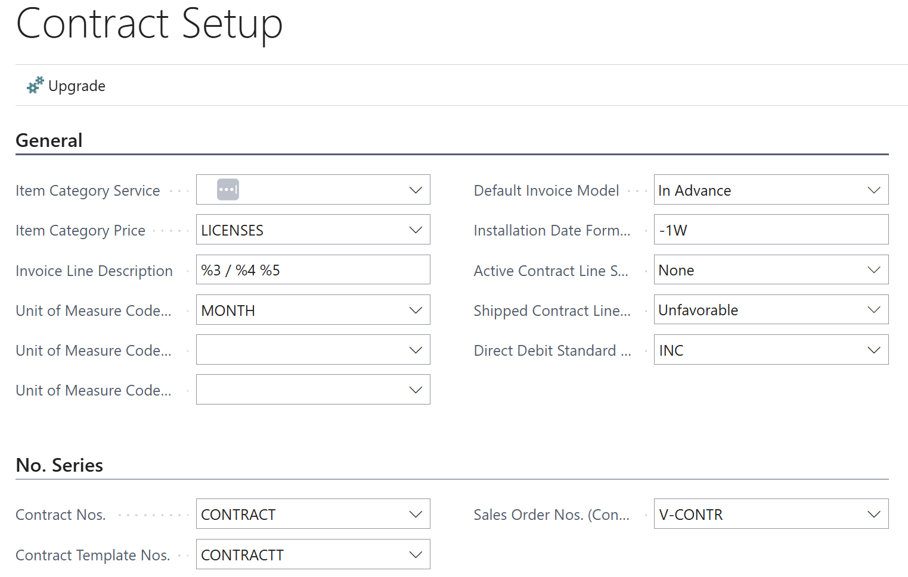
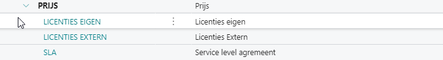
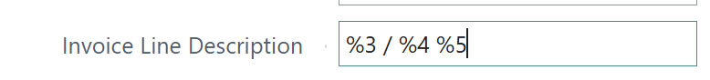
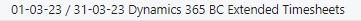
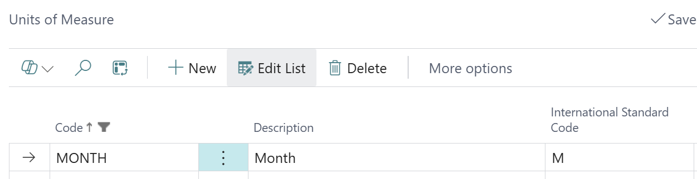
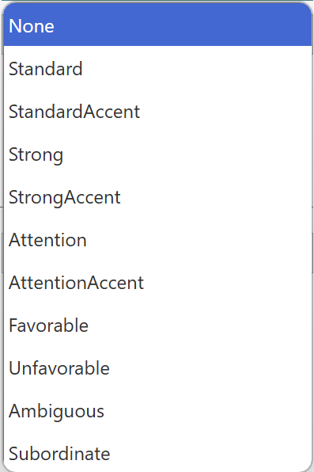
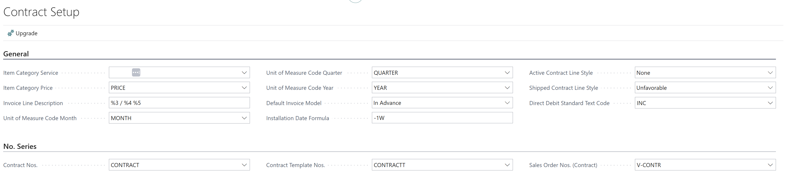

# Manual Technical Management: Contracts
## Basic setup

Before creating a contract, you need to add some basic setup in Business Central. To do this, go to the Contract Setup.

The following page opens:

This manual only discusses making contracts with the item category price. This means there is no link to the objectsa and service items.

### Item Category

When you want to periodically charge items to the customer, the system must recognize them as items that may be included in a contract. This is controlled based on the item category.

It is possible to create one main category and one subcategory below it to group it properly.
Below is an example to illustrate:

If you select a subcategory, such as SLA, on the product card, the item is available for adding it to a contract if the main category is entered in the contract settings as item category price.

### Invoice Line Description

If you include an item on a contract, it is helpful to include additional information on the invoice line.

For this purpose, creating a self-chosen invoice line description in the settings is possible.

The following placeholders can be used: %1=Contract No., %2=Item No., %3=Starting Date, %4=Ending Date, %5=Description, %6=Price Item Description, %7=Object Reference

The order and which fields are included are adjustable.

The above setting results in the following description on the invoice:

Where the description is the description on the contract line, the invoice line has a maximum of 100 characters; it is essential to consider this if there is also a period description.

When choosing %6=Price item description, the translation will be done when sending a contract and will show up on the contract shipment line when it is created on the item.

### Unit of Measure Code Month
Specifies the unit that will be used for month, serving as the base unit for contracts.
The standard units do not yet contain the periodic units that must be created.

### Unit of Measure Code Quarter/Year
It is essential to specify again what units are used for quarterly or annual invoicing.

### Default Invoicing Model
This allows you to choose in advance or afterwards. It determines whether an invoice is created at the beginning or end of the invoice period.

The value in the Contract Setup only defines the default setting. It's possible to deviate in specific contract (templates).

### Active/Sent Contract Line Style
This allows you to choose the color/style in which completely shipped and active contract lines are displayed, allowing you to make a better visual distinction on a contract.

The following options are available for this:

The following colors and layout are included:

| Value            | Description                 |
|------------------|-----------------------------|
| None             | None                        |
| Standard         | Standard                    |
| StandardAccent   | Blue                        |
| Strong           | Bold                        |
| StrongAccent     | Blue + Bold                 |
| Attention        | Red + Italic                |
| AttentionAccent  | Blue + Italic               |
| Favorable        | Bold + Green                |
| Unfavorable      | Bold + Italic + Red         |
| Ambiguous        | Yellow                      |
| Subordinate      | Grey                        |

### No. Series for Contract Templates and Contract
The contracts and templates have their number sequence, which must be created and linked before they can be used.

Below is an example of the settings included to work with the contracts.

[:arrow_left:](../README.md) [Back](../README.md)