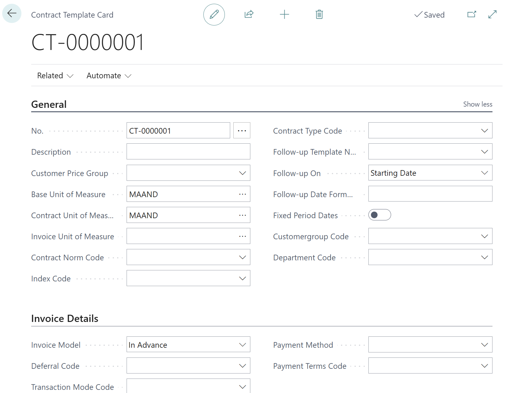

# Manual Technical Management: Contracts
## Contract templates
We recommend using contract templates when working with contracts. You can find these by clicking on the magnifying glass (Tell me) and search there for contract templates.

The following is an explanation of the different fields on the contract template.

### General

| Field  | Description |
|-------------------------------------------|---------------------------------------------------------------------------------------------------------------------------------------------------------------------------------------------------------------------------------------------------------------------------------------------------------------------------------------------------------------------------------------------------------------------------|
| No. | The number follows from the settings, and if the number series is set up accordingly, it will be created automatically. |
| Description | Here, you enter the template's name, which you can recognize. |
| Customer Price Group | In addition to using the item unit prices, creating a customer price group is possible. Price agreements can be made based on various settings for the customer and the items. |
| Base Unit of Measure | This must always be filled and therefore linked to the unit's month. |
| Contract Unit of Measure | This allows you to specify the periodicity at which you will create a contract. It can be monthly, quarterly, half-yearly, yearly, or three-yearly. |
| Index Code | The Index Code determines for which items the price will be indexed. It's possible to only index manually changed contract prices with a specific percentage or amount. For contract lines that follow the sales price structure, indexing will determine the changed unit price based on the starting date. The index code can be left blank if manual pricing is not used. |
| Follow-up Template No. / Follow-up On / Follow-up Date Formula | It is possible that a contract applies under certain conditions for the first year and under other conditions for the 2nd year. This is often used in service contracts, e.g., free services in year 1 and 50% charge in year 2. This is essential for service contracts. The mentioned fields determine what contract template will be used for a newly created follow-up contract line and when it must be created. |
| Fixed Period Dates | Ensures that contract lines created on a starting date other than the periodicity starting date are aligned during releasing a contract. The created contract line, with the invalid Starting Date, will be splitted into two lines. A new line is created, starting on the periodicity date. For example: A quarterly contract starting 10-4 will be closed 1 day before the intended periodicity start date (30-6) , and a new contract line will start on the intended starting date (1-7). This is useful for aligning indexing dates. |

The following overview shows the starting and ending dates that will be enforced when using Fixed periods:

| Fixed Starting Date | Enforced Starting Date | Ending Date Original Line |
|---------------------|------------------------|----------------------------|
| Year                | 1-1-XXX                | 31-12-XXXX                 |
| Quarter             | 1-1-XXX                | 31-03-XXXX                 |
|                     | 1-4-XXX                | 30-06-XXXX                 |
|                     | 1-7-XXX                | 30-09-XXXX                 |
|                     | 1-10-XXX               | 31-12-XXXX                 |

### Invoice details

| Field | Description |
|------------------------|------------------------------------------------------------------------------------------------------------------------------------------------------------------------------------------|
| Invoice Model | The invoicing model is copied from the contract settings, but this can be setup specifically at the contact template and contract level. |
| Deferral Code | Linking a deferral code to contracts with an In Advance Invoice Model is possible. This ensures that contract invoices that apply over multiple periods are posted in the correct month. |
| Transaction Mode Code | This indicates whether f.i. the customer pays via direct debit or by account. If you have not yet installed an automatic bank link, this is important for proper direct debit execution. |
| Payment Method Code | The automatic bank link uses the payment method to determine how the invoice is paid, f.i. SEPA or Direct Debit. |
| Payment Terms Code | By default, the payment conditions of a contract are defined by the Bill-to Customer. Deviation on contract template and contract level is possible using this field.

Below is an example of a completed contract template. 

[:arrow_left:](../README.md) [Back](../README.md)

