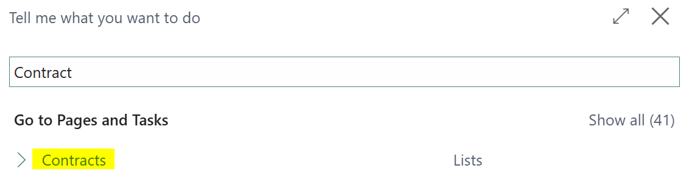

# Manual Technical Management: Contracts
## Create a contract
After entering the basic setup in the Contract Setup and creating a contract template, a contract can be created. Working with a contract template is not a requirement, but it is recommended because the template provide default values to some fields.

To navigate to the contracts, select the magnifier glass (Tell me) and search for contracts.

The following screen opens:

### Creating a contract with a template
You can create a contract from scratch or through a contract template.
Creating a contract from scratch means that all fields that were filled on the contract template must also be filled on the contract header. Therefore, we will only discuss creating a contract based on a contract template.

To create a contract based on a template, go to Actions -> Create with template in the ribbon of the contract card or list.

Select the template you want to use and click OK.

A contract card is created. A contract consists of a header with lines. It is essential to create the header completely before filling in the contract lines, as some header fields can no longer be changed once contract lines have been created.

Below is an explanation of the fields that have not yet been covered by the contract template.

### General

| Field | Description |
|-----------------------|------------------------------------------------------------------------------------------------------------------------------------------------------------------------------------------|
| No. | This is the number that is retrieved from the linked no. series in the contract settings. |
| Description | This is a title for the contract. |
| Sell-to Customer No. | After selecting the sell-to customer, the invoice customer will automatically be filled with the same value or the default bill-to customer that is available on the sell-to customer |
| Sell-to Customer Name | This field is not editable but shows the name of the registered Sell-to Customer. |
| Bill-to Customer No. | This field makes it possible to define a different Bill-to Customer for a contract. By default it's filled with the Sell-to Customer No. or (when applicable) the default Bill-to Customer that is defined on the selected Sell-to Customer. |
| Bill-to Customer Name | This field is not editable but shows the name of the customer who chose the invoice.  |
| Your Reference | This field references the contract, such as the purchase number/purchase order number/relevant department that the customer wants to see on the invoice. |
| Document Date | This field is the contract date. There is no further link to other fields. It can be used as a reference for the signing date, filled in at your discretion. |
| Last Index Date | This field is filled during the re-indexing a contract and cannot be changed manually. |
| Status | A contract can either be Open or Released. When a contract is Open, the contract can be changed. When it's released, modifications are blocked. |

When a contract is Released, the concept is that the contract header and lines are checked and ready for further processing (shipping and invoicing). After shipping, contract data is transferred to sales orders with the status released. It is basically not the intention that the sales order will be adjusted, so editing the contract lines on a sales order is not recommended.

### Invoice details
When a contract is created from a template, it's possible to deviate from the default values on the customer or contract template here.

F.i. the The currency code can be filled with a different currency. The Direct Debit Mandate ID can also be linked. If a customer only wants to use Direct Debit collection for contracts and f.i. all other orders processed through bank, this can be controlled using this field.

### Lines

<u>Item No.</u>

After filling in the header, you can start filling in contract lines. For an item to be available in a contract, the item must be linked to the item category that is defined in the Contract Setup as Item Category Price or an item category that is linked directly to that item category . It is also crucial that an item contains the units of measures that are used on the contract.

To do this, go to the Item Card and the define them there.

The Base Unit of Measure of the Contract, a month, must always be included. Besides that one, also units of measure for a quarter and year must be defined if applicable on the contract.

The month is always the Base Unit of Measure on a contract. Therefore, the Unit Price on the item must be an amount per month. For the other Units of Measure, it is mandatory to specify the Qty. per Unit of Measure (Quarter = 3 and Year = 12).

When selecting the item, the description from the item card is entered automatically, as well as the unit price and the contract unit of measure code. You have to determine the quantity yourself.

The starting date determines, together with the ending date, the validity of the line. The starting date is filled by default with the work date, but it can be changed to the date necessrry.

<u>Price Manually Adjusted</u>
When the Unit Price is manually changed on the contract line, the field Price Manually Adjusted field is enabled by default. It's also possible to enable the field Price Manually Adjusted as a user. 

As a result, you can then work with the re-indexing on the contract with fixed values (a fixed amount or a percentage). If the check mark is not selected, you can still index, but then the price from the sales price list (possibly specifically set up for a customer price group) and the item unit price is leading.

<u>Ending Date</u>
This determines the ending date (up to and including) of the validity of the contract line. Together with the starting date, this date determines whether sales orders will be created through shipping the contract.

If the ending date of the contract commitment is known in advance, it can be filled in immediately. If the ending date is not yet known, it can be filled in or adjusted later.

<u>Last Shipment End Date</u>
A contract can be shipped. This results in a sales order and a sales shipment, which can be invoiced. When a line is shipped, the ending date of the last contract shipment action is shown in this field.

Once a line has been sent, it cannot be deleted anymore; it will from that moment on always exist in the contract archive. 

<u>Original Starting Date</u>
Specifies the Original Starting Date of the contract line.

Once a contract line has been shipped with a certain quantity, changing the quantity or price is no longer possible.
An additional contract line must be created if those values must be changed. 

However, when there are many mutations, this becomes unclear.
Therefore, it is also possible to close the old contract line and let the new contract line take effect with the new quantity and price from the mutation starting date (through the field Starting Date). The field Original Starting Date can then be entered with the Starting Date of the original contract line that is replaced, to keep track of the complete contract period for a line.

This field is filled automatically when new lines are created due to Fixed Period Dates, during releasing the contract. This is also the case during re-indexing contract lines.

### Contract Overview
The contract contains the possibility to print an overview.
This report can also be e-mailed to the customer. 

Below is an example of the report.

### Comments
It is also possible to comment on the contract for the internal organization. To do this, use the action Related -> Comments in the ribbon of the contract.

Here you can record any comments yourself. It's not necessary to reopen the contract to record comments. Comments are automatically transferred from the contract to the latest available contract archive.

[:arrow_left:](../README.md) [Back](../README.md)