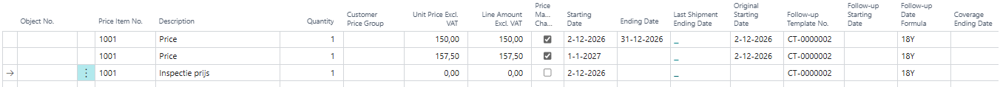
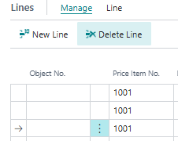
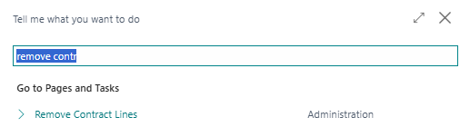
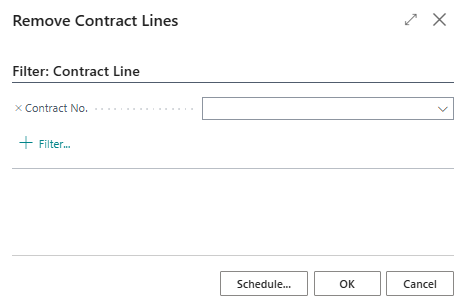
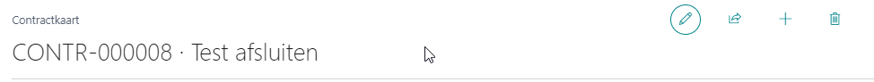

# Manual Technical Management: Contracts
## Deleting contracts/contract lines
Contract lines with an Ending Date in the past and a Last Shipment Ending Date matching the Ending Date are, in principle, no longer active. It is possible to clean-up contracts in various ways.

You can delete the contracts from the Contract List. When doing this, the Contract Archive will remain intact but it will not be possible to edit the contract anymore.

The prerequisite for deleting contracts or contract lines is that an Ending Date has been entered and in the past, the Last Shipment Ending Date is in the past and equals the Ending Date, and all related Sales Orders have been invoiced (not just sent) .The work date does not influence this; it is about the actual date that applies here. It's also possible when a contract line is not yet started.

You can delete contracts or only specific contract lines.

### Deleting contract lines

When you want to delete a line within a contract, the contract must have the status open.
In the example below, only the bottom line can be removed. This manual was created on 17-3-2023.

You select the line and then click on Manage -> Delete Line

After this, the line in the active contract disappears, but it can always still be found in the contract archive.

It's also possible to execute a batch process to remove all lines that are no longer active.
To execute this batch, use the magnifier glass (tell me) and search for Remove Contract Lines:

The following screen opens, which allows you to specify a selction of contract lines that must be considered for removal. This process can also be run from the Job Queue.

If the deletion is performed through the, the contract is no longer required to have the open status. The report processing will handle this.

### Deleting contracts
As soon as all lines within a contract have an ending date in the past compared to the current date,  it matches the value in the field Last Shipment Ending Date and all related Sales Orders have been invoiced, the contract can be removed. In order to do so, the status of the contract must be Open.

After the contract is reopened, when the status was not already Open, it is possible to delete a contract by using the button on the Contract Card.

This can also be done by using the action on the contact list that can be found under Manage -> Delete.

[:arrow_left:](../README.md) [Back](../README.md)