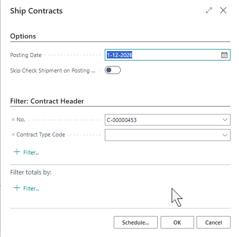

# Manual Technical Management: Contracts
## Processing contracts
The contract can be released if the fields on the header and the contract lines correctly filled.

### Release and ship contracts
Contracts can only be shipped if they have the status Released. 
This can be done with the Release action in the ribbon.

#### Contract archive

Knowing that an archive version of the contract is created every time a contract is released is essential. These versions can be found on the right side of the contract card in the details overview, in the factbox area:

You can also go to Related -> Archive action in the ribbon of the page.

If you click on the archive, you will be taken to the next screen, where you can click through to the previous versions of the contract.

#### Shipping
To trigger invoicing based on a contract, you must ship a contract. To do this, go to Actions -> Ship in the ribbon of the contract. When a contract is shipped, the contract lines are transferred to sales orders with sales order lines which can be processed using standard Business Central procedures. Please note that when shipping a contract, the created sales orders are automatically shipped.

The following screen opens:

You can only ship contracts with the status released. This can be done one-by-one or in batch. To determine which contracts are included, modify the filter in the screen above. For example: You can use the fields Sell-to Customer No. or Bill-to Customer No. to ship all contracts for a specific customer.

The Posting Date field is of great importance here. It defines the Posting Date of the Sales Order that is created and the date that is used to handle deferral.

The Posting Date, in combination with the starting date of the contract line, the contract unit of measure, and the invoicing model, determines whether a contract line is included.

The example above will not include the contract during shipping, because the posting date is 1-4 and the contract line starts on 10-4.

The example below shows that the last shipment ending date if filled, based on earlier shipping actions.
It is a quarterly invoiced contract with Invoice Model In advance. The posting date during shipping has been set to 1-1-2023.

Creating sales orders and sales order lines during shipping is based on the information in the contract shipment lines. The records in this table are created during the shipping. You can navigate to this information using Related -> Shipment Line in the ribbon of the contract

On this page, you can navigate to the created sales order, the posted shipping lines, the invoice lines, and the posted invoice lines. Of course, you can also go directly to the sales orders by using the magnifier glass (tell me) and search for Sales Orders. The orders created from the contracts module are normal sales orders.

When a sales order is created, f.i. the values of Sell-to Customer No., Bill-to Customer No., Your Reference (if supplied) of the contract, are transferred to the Sales Header. The sales order lines represent all item lines that must be shipped based on the contract. The description of the line is based on the Contract Setup. On line level, also the specified deferral code and the price can be found for the shipping period.

Because the order is already shipped, it can directly be invoiced:

By applying the deferral code, the turnover of the contract is neatly spread over the 3 months in the quarter in this example:

### Correcting contracts

Errors may have occurred in a contract. 
Here is how to deal with a couple of common scenarios.

- Deleting a contract line that is not yet shipped
If a contract line does not have a Last Shipment Date yet, it can still be deleted or changed without any consequences.

- Adjusting a contract line that has been shipped but not invoiced
After a contract line is shipped, a sales order is already shipped for that line.
Still, it's possible that something is not correct.

In this case, you can undo the shipment that is related to the line that must be corrected. You can then remove the line from the sales order.

Open the order associated with the contract shipment line. Navigate to the shipments by using the ribbon:

Navigate by using the field No.

After this, you can select the relevant line on the shipment and undo that line.

After this, the Last Shipment Ending dat is, and this contract line must then be closed by setting the Ending Date. The intention is to create a new contract line after this is done, because the corrected line for the same period will not be shipped again by the system.

[:arrow_left:](../README.md) [Back](../README.md)