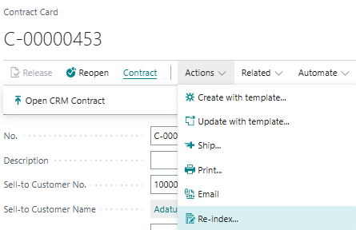
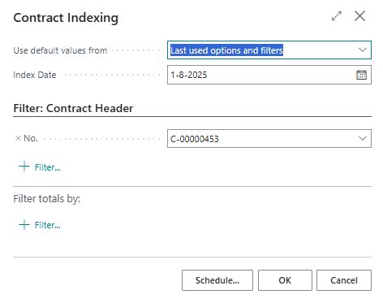
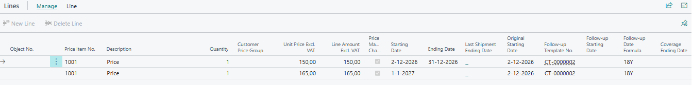
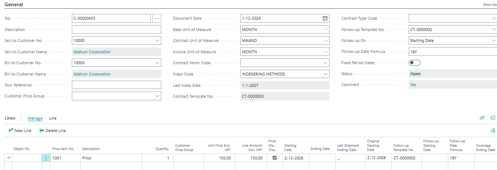
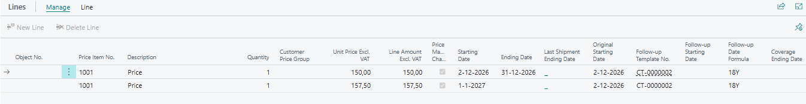

# Manual Technical Management: Contracts
## Re-indexing
The contracts module has support for price changes on a specific date due to indexation.

### Re-index with the index code for sales prices
In this specific scenario there are two sources for the price that will be used during re-indexing.
- The Sales Price List for the specific customer or customer price group
- The Unit Price on the Item Card

To make sure that the new price that must be used on the contract, ensure that the starting date of that price in the Sales Price List matches the index date that will be used later on. Also an index code must be used on the contract that specifies re-indexing based on Price List.

To illustrate this process, the unit price on the item has been adjusted from 50 to 55 euros.
After this has been done, it is possible to re-index the contract.

To do this, you open the contract card and go to Actions -> Re-index in the ribbon.

The following screen opens:

You can perform this action filtered or across all contracts in 1 go. To do the latter, remove the Contract No. filter. You must specify an index date, this is the date from which the new price must take  effect. In this example, 1-4-2023 has been chosen.

After processing the re-indexing, the old contract line is closed, and a new contract line is created with the newly calculated item unit price. The original starting date is included on the new line.

### Reindex with the index code for manually adjusted prices
To do this, the contract header must include an index code that is set up adjust manually changed prices.

In this case, a 5% percentage has been set. The effect is the same as described above. However, the calculation is now based on 5% of the contract line price. Not on the sales price list or item price.
The index date here is set to 1-7-2023.

In both cases, indexation is not retroactive if the re-indexation date is before the end date of the last shipment. If the active contract lines do not have an end date for the previous shipment, they will be indexed depending on the indexation date.

[:arrow_left:](../README.md) [Back](../README.md)